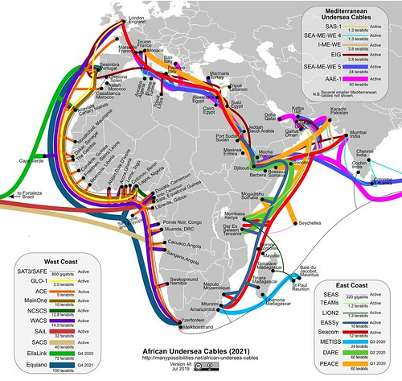

# Getting started

This section of the magma guide provides an overview of the primary building
blocks for Internet censorship research. Users conducting this type of research
for the first time should review this entire section before beginning their
work. Information on the five topics discussed below (ISP lists,
Country-specific telecommunications information, Submarine and terrestrial cable
visualizations, Prior related research, and Website lists) should be gathered
prior to conducting any new information controls research.

At the end of this section, a case study is offered to demonstrate the type of
information these techniques would produce for a user conducting research on
information controls in Tanzania.

## ISP lists

Prior to conducting any specific information controls research, it is important
to understand the type of Internet connectivity available in your country/region
of interest. A good place to find this information is through the website
[ISPQuickList.com](https://www.ispquicklist.com/), which provides Internet
Service Provider (ISP) lists and information on the type of connectivity
available in a geographic area or country (such as wireless, broadband, DSL,
ADSL, cable, etc.).

Another resource that contains relevant market share data is Wikipedia's
[list of mobile network and satellite phone network operators](https://en.wikipedia.org/wiki/List_of_mobile_network_operators).

## Country-specific telecommunications information

Before you begin any targeted research, it is also important to understand the
telecommunications context for your chosen country/region. Wikipedia articles
such as
[Telecommunications by country](https://en.wikipedia.org/wiki/Category:Telecommunications_by_country)
and
[Internet censorship and surveillance by country](https://en.wikipedia.org/wiki/Internet_censorship_and_surveillance_by_country)
often provide useful information on country-specific telecommunications and
censorship/surveillance. When possible, users should review the content offered
in different languages on each page as certain languages are updated more
frequently/have different content.

## Submarine and terrestrial cable visualization

Obtaining a basic understanding of the general cable infrastructure for a given
country, region, or geographic area is beneficial prior to conducting
information controls research. That’s because the physical infrastructure of the
Internet is comprised of various submarine and terrestrial cables that connect
countries, continents, and regions to each other and the online world. Visual
representations of these cables (i.e. connectivity maps) help researchers better
understand and assess the interconnectivity of a specific country or a region.

Such representations are particularly helpful when working to assess the
upstream and downstream effects of information controls (when an upstream
country blocks specific Internet services, the downstream country or region
receiving connectivity will almost certainly experience the same form of
Internet blocking). The resources detailed below are available to help users
gain this important understanding.

### African Undersea Cables

The website
[Many Possibilities](https://manypossibilities.net/african-undersea-cables/)
(available in both English and French) provides an up-to-date map of African
undersea cables, as well as information on the cable ownership and investors. An
animated GIF map is also available, documenting the history of African undersea
cables over time.

### Infrapedia

[Infrapedia](https://live.infrapedia.com/) provides an interactive,
crowd-sourced, nearly real-time map of the global Internet infrastructure. The
map details the world's submarine and terrestrial networks, as well as other
critical infrastructure assets. Once users set up an account, they have the
ability to network and connect with other professionals.

### TeleGeography

[TeleGeography's](https://www.submarinecablemap.com/) interactive submarine
cable map shows the majority of active and planned international submarine cable
systems around the world, as well as their landing stations. Users can select a
specific cable route on the map to access data about the cable including its
name, ready-for-service (RFS) date, length, owners, website, and landing points.
Users can also select a specific landing point on the map to view a list of all
submarine cables landing at that station. The datasets used for the submarine
cable map (submarines cables and landing points), as well as the source code,
are freely available under under the Creative Commons Share-alike non-commercial
license and can be found on their
[Git repository](https://github.com/telegeography/www.submarinecablemap.com).

## Prior related research

Before beginning your work, it is also important to understand what other
research has already been conducted on your topic/country of interest. Often
times a similar or related study exists. You should always review these studies.
Even if the information is old or outdated, reviewing prior research will
provide you with helpful background information on previous regulations or
filtering/censorship incidents. If you cannot find any prior research that
specifically relates to your selected country/region, note that you can always
expand your search to encompass nearby countries (Internet blocking
methodologies are often linked/shared geographically).

## Website lists

Prior to determining whether website access is being blocked or restricted, you
must first obtain a list of the most visited websites within a specific
region/country. This type of website list research is important because it will
allow you to build high-quality test-lists (a topic covered in "Testing
methodology"). The magma guide suggests using publicly available data from
Quantcast, Alexa, and Curlie to perform this task.

### Archive webpages

<!-- prettier-ignore -->
::: tip
When conducting website list research it is always a good idea to
capture the specific version of the webpage you viewed so that it can be still
be cited and relied upon as evidence in the event of future content alteration
or removal.
:::

Wayback Machine's Internet archive function allows users to "snapshot" and
archive a webpage as it appears at the time of saving, ensuring you will be able
to access the exact same version of it in the future. Go to the "Save Page Now"
section of https://web.archive.org/ to perform this essential function. Be aware
that when entering the address of the webpage you wish to save, you must enter
the full original source address (URL shortening services,such as `goo.gl` or
`bit.ly`, will not work). You can also find a list of other web archives service
at the [OSINT source section](osint-sources#web-archives).

### Quantcast's top international websites and rankings

Quantcast ranks websites based on the number of people in a country that visit
each measured website within a month. Rankings for a given country only include
websites with traffic that Quantcast has independently verified. Quantcast
directly measures site traffic through the implementation of the Quantcast
asynchronous tag on each website.

Usage URL: `https://www.quantcast.com/top-sites/XX` (where `XX` is the country
code for the country you are researching)

### Alexa's top sites

Alexa ranks websites based on four criteria:

- Daily Time On Site (updated daily based on the prior 3 months): Estimated
  daily time on site (mm:ss) per visitor to the site.
- Daily Pageviews Per Visitor (updated daily based on the prior 3 months):
  Estimated daily unique pageviews per visitor on the site.
- Percent Of Traffic From Search (updated daily): The percentage of all
  referrals to the site that came from search engines over the prior month.
- Total Sites Linking In: The total number of sites that Alexa found that link
  to the site.

The free version of Alexa provides access to the 50 top websites per country,
region and category.

Usage URL: `https://www.alexa.com/topsites/countries/XX` (where XX is the
country code for the country you are researching)

### Curlie

Curlie is the successor of DMOZ, a multilingual open-content directory of web
links. The site, as well as the community that maintains it, is also known as
the Open Directory Project. It uses a hierarchical ontology scheme for
organizing site listings. Listings on similar topics are grouped into categories
and sub-categories. Curlie's database, curated by more than 90,000 editors, is
extensive. It features URLs in more than one million categories, available in 90
different languages. There are no commercial restrictions and the work is
published under a Creative Commons Attribution 3.0 Unported License.

Usage URL: `https://curlie.org/Regional/Region/Country` (where /Region/Country
is the region and country you are researching)

## Case study: Tanzania

The following case study illustrates the research techniques discussed above.
The data below is what you would find if you followed the magma guide's
suggestions when conducting background research on information controls in
Tanzania.

### List of ISPs in Tanzania (ISP lists)

Tanzania has a list of 11 ISP's:

| ISP name        | ISP link                                  |
| --------------- | ----------------------------------------- |
| Africa Online   | http://www.africaonline.com/countries/tz/ |
| Airtel Tanzania | http://africa.airtel.com/tanzania         |
| Alink Telecom   | http://www.alinktelecom.net               |
| Habari Node     | http://www.habari.co.tz/                  |
| iWayAfrica      | http://www.iwayafrica.com/                |
| Sasatel         | http://www.sasatel.co.tz                  |
| SatCoNet        | http://www.satconet.com/                  |
| SimbaNET        | http://www.simbanet.co.tz/                |
| Tigo            | http://www.tigo.co.tz/                    |
| Vodacom         | http://vodacom.co.tz/                     |
| Zantel          | http://www.zantel.co.tz                   |

Source:
[IspQuickList - List of Internet Service Provider in Tanzania](https://web.archive.org/web/20190706171242/http://www.ispquicklist.com/internet-service-providers-list-in-Tanzania.aspx)

### ISP market share of Tanzanian ISPs (Country-specific telecommunications information)

As of December 2018, the market share among Tanzanian mobile telephone
operators, as reported by those operators, was as follows:

| Rank | Operator                                                        | Customers  | Market share percentage |
| ---- | --------------------------------------------------------------- | ---------- | ----------------------- |
| 1    | Vodacom Tanzania Limited (trading as "Vodacom")                 | 14,143,657 | 32.42                   |
| 2    | MIC Tanzania Limited (trading as "tiGo")                        | 12,583,640 | 28.85                   |
| 3    | Airtel Tanzania Limited (trading as "Airtel")                   | 10,954,621 | 25.11                   |
| 4    | Viettel Tanzania Limited (trading as "Halotel")                 | 3,942,237  | 9.04                    |
| 5    | Zanzibar Telecom Limited (trading as "Zantel")                  | 1,153,641  | 2.64                    |
| 6    | Tanzania Telecommunications Company Limited (trading as "TTCL") | 711,411    | 1.63                    |
| 7    | Benson Informatics Limited (trading as "Smart")                 | 132,292    | 0.30                    |
|      | Total                                                           | 43,621,499 | 100.00                  |

Source:
[TCRA - TelCom_Statistics_December_2018.pdf](https://web.archive.org/web/20190925163401/https://www.tcra.go.tz/images/documents/telecommunication/TelCom_Statistics_December_2018.pdf)

### African undersea cable map (Submarine and terrestrial cable visualizations)

Source:
[Manypossibilities.net African undersea cables](https://web.archive.org/web/20190912235249/https://manypossibilities.net/african-undersea-cables/)

### Telecommunication and postal regulations in Tanzania (Prior related research)

- [The electronic and postal communications (online content) regulations, 2018](https://web.archive.org/web/20180504073328/https://www.tcra.go.tz/images/documents/regulations/SUPP_GN_NO_133_16_03_2018_EPOCA_ONLINE_CONTENT_REGULATIONS_2018.pdf)
- [The cybercrimes act, 2015](https://web.archive.org/web/20171119152220/https://www.tcra.go.tz/images/documents/policies/TheCyberCrimeAct2015.pdf)
- [Electronic and Postal Communications (Tele-traffic)](https://web.archive.org/web/20190925162315/https://www.tcra.go.tz/images/documents/regulations/14._The_Electronic_and_Postal_Communications_Electronic_Communications_Equipment_Standards_Regulations___2018.pdf)
- [Electronic and Postal Communications (Computer Emergency Response Team)](https://web.archive.org/web/20190925162609/https://www.tcra.go.tz/images/documents/regulations/11._GN._60___Electronic_and_Postal_Communications_Computer_Emergency_Response_Team_Regulations_2018.pdf)
- [List of online content services licenses issued by 31st July, 2018](https://web.archive.org/web/20190925164320/https://www.tcra.go.tz/images/headlines/Licensed_Online_Content_Service_Providers__31st_July_2018.pdf)

### Tanzanian website rankings (Website lists)

#### Quantcast

Source:
[Top Websites & Rankings for United Republic of Tanzania | Quantcast](https://www.quantcast.com/top-sites/TZ)

#### Alexa

Source:
[Alexa - Top Sites in Tanzania](https://www.alexa.com/topsites/countries/TZ)

#### Curlie

Source:
[Curlie - Regional: Africa: Tanzania](https://curlie.org/Regional/Africa/Tanzania/)
