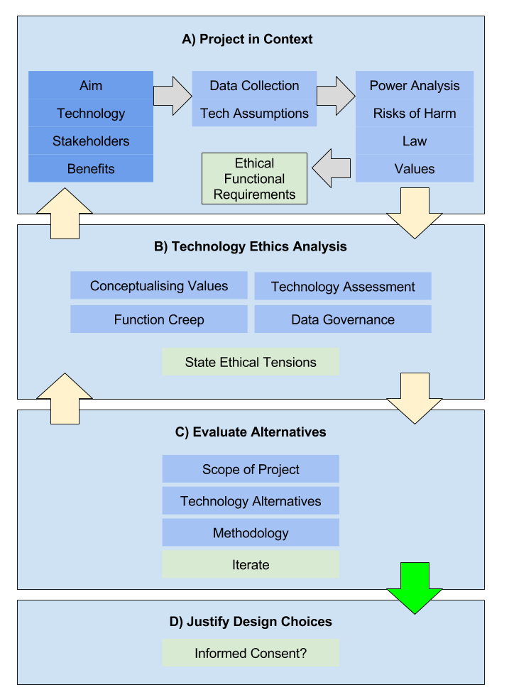

# Network measurements

This section of the magma guide discusses network measurement: the process of
measuring specific types of network activity to determine if there is any
interference or abnormality occurring on a particular network. The first several
subsections below detail the various types of network measurements that can be
performed, the hardware needed to conduct them, and the vantage points from where they
will need to be conducted. The final subsections lay out network measurement
best practices, associated risks, relevant ethical considerations, and
volunteering considerations.

## Types of network measurements

<!-- Add Complete list of Internet censorship methodologies -->

Over the years a number of different methodologies have been developed to detect
filtering/blocking of network resources, tampering with communication channels,
and intentional manipulation of network routes. These types of methodologies can
be categorized as either passive or active, depending on how they are deployed.

<!--
\textit{XXX: Complete list of Internet censorship detection
methodologies}
\textit {XXX: Explain the different between active and passive Internet
censoship detection methodologies}

\textit{XXX: Active/passive list of Internet censorship
detection methodologies}
-->

### Active/passive network measurements

Most network measurement techniques rely on passive detection methods that can
be performed automatically from anywhere. Such techniques typically visualize a
small subset of potential Internet censorship events within specific networks,
countries, or geographic areas. Because the results from these techniques
usually come from a limited number of vantage points (sample), they often provide an
limited view of the actual Internet censorship landscape. Still, these
techniques can be helpful when there is already evidence of an Internet
censorship event occurring in a specific network segment or region, but the
existing data are not enough to generalize about the nature,
methods, and incentives behind the censorship activity.

Active detection methods are network measurements that are performed manually by
either an entity or an individual. This type of network measurement typically
provides a more precise understanding of the actual network filtering or content
blocking that is occurring within a specific network segment. Due to their
“active” nature these measurements are more challenging to conduct because they
must be deployed from vantage points that either have access to, or are located
within, the underlying network being measured. Note, however, that when active
network measurements are deployed from vantage points outside the investigated
network, their results do not always represent an accurate view of the network
anomalies.

<!-- Revise this section
Research related to network measurements via side channel interferences proposes
techniques that can discover intentional packet drops ([Detecting Intentional
Packet Drops on the Internet via TCP/IP Side
Channels](https://ensa.fi/papers/Ensafi2014c.pdf), idle scans ([Antirez: new tcp
scan method], [The Official Nmap Project Guide to Network Discovery and Security
Scanning](https://ensa.fi/papers/Ensafi2014c.pdf#cite.nmapbook), [Idle Port
Scanning and Non-interference Analysis of Network Protocol Stacks Using Model
Checking](https://www.cs.unm.edu/~treport/tr/10-01/paper-2010-03.pdf), inferring
information about remote networks([Off-Path TCP Sequence Number Inference
Attack: How Firewall Middleboxes Reduce
Security](https://www.cs.ucr.edu/~zhiyunq/pub/oakland12_TCP_sequence_number_inference.pdf)
or by using the `IPID` field to measure the amount of internal traffic generated
by a server, the number of servers in a load-balanced setting, and one-way
delays ([Exploiting the IPID field to infer network path and end-system
characteristics](https://www.cs.purdue.edu/homes/ribeirob/pdf/Chen04_IPID.pdf).
Further research compounds loss on specific routes to estimate the packet loss
between arbitrary endpoints without access to those endpoints ([iPlane: An
Information Plane for Distributed
Services](https://web.eecs.umich.edu/~harshavm/iplane/).

Another approach utilizes recursive DNS queries to measure the packet loss
between a pair of DNS servers, and extrapolates from this to estimate the packet
loss rate between arbitrary hosts ([Queen: Estimating Packet Loss Rate between
Arbitrary Internet
Hosts](https://www.microsoft.com/en-us/research/publication/queen-estimating-packet-loss-rate-arbitrary-internet-hosts/)

Control plane and data plane datasets such as: BGP interdomain routing,
unsolicited dataplane traffic to unassigned address space, active macroscopic
traceroute measurements, RIR delegation files, and MaxMind’s geolocation
database have been used to determine which forms of Internet access disruption
were implemented in a given region over time ([Analysis of Country-wide Internet
Outages Caused by
Censorship](https://www.caida.org/publications/papers/2014/outages_censorship/outages_censorship.pdf).
Moreover a methodology that collects information on DNS resolution and resource
availability around the Internet by probing the IPv4 address space is used to
detect cases of ISP level DNS hijacking in a number of countries.
-->

### Other network measurements

- Measurements to detect internet censorship, information controls, or other
  types of network filtering (e.g.: VPNs, anonymity networks).
- Measurements to detect network throttling, net neutrality, data
  discrimination, or alternated content based on geographical location.

## Hardware

Several types of hardware can be enlisted to perform network measurements, most
notably mobile phones and stationary hardware devices.

### Mobile phones

Mobile phone is the most accessible and user-friendly type of hardware that can
be used to perform network measurements. With access to a single phone, a user
can perform network measurements from a variety of different networks by
changing and connecting to other networks (either by mobile or with the use of
SIM cards from various mobile operators).

But certain difficulties and concerns arise from using a mobile phone to conduct
network measurements. It can be challenging to orchestrate and perform
longitudinal (periodic) network measurements with a mobile phone as doing so
requires physical attendance and manual instrumentation of network measurements.
In addition, the device’s mobility can also present problems as its very nature
makes the device more prone to failures and possible errors in network
measurements. Battery and storage capacity are also limiting factors that can
affect the successful completion and collection of data when using a mobile
phone.

Mobile phone users should be aware that they can be easily tracked and
identified by service providers, governments, and law enforcement agencies.
Depending on a user’s threat model, a heightened degree of attention may be
required when performing Internet censorship or surveillance related network
measurements on a phone.

### Stationary hardware devices

Stationary hardware devices, such as desktop computers, servers, or embedded
devices, can be utilized to perform uninterrupted as well as longitudinal
(periodic) network measurements. These devices can be set up to require minimal
or almost no physical attendance when conducting network measurements. Depending
on the connection type, network bandwidth is typically not a limiting factor
when using these devices. They also have greater storage capacity than mobile
phones and can often operate uninterrupted to collect and store network
measurements.

Trade-offs still exist, however, when using stationary hardware devices. Due to
their fixed position, it is difficult to interchange, connect, and perform
network measurements on different networks. Associated risks typically pertain
to Internet access connection types and subscription plans.

<!--
### Hardware type comparison
| Type | Storage | Power | Risks |
-->

## Vantage points

In order to achieve an accurate view of the Internet censorship activity in a
specific area, access to vantage points from network(s) within the area is
required. Vantage points can either be geographically bound or accessed
remotely.

<!-- prettier-ignore -->
::: warning NOTE
You should always ask for permission to use a specific network or vantage point
for network measurements or any network related research (see the ISP inquiry template below). Always review the
terms of service and acceptable usage policy of any given subscription plan or
network.
::::

### Geographically bound

Geographically bound vantage points, such as broadband services and mobile data
connections, require "physical access" to a network (either the user or the
equipment being used must be physically located within the network area being
measured). Although this isn't always easy to achieve, such vantage points are
particularly important for research purposes because they are often operated by
local or regional ISPs which are known to implement extensive network filtering
practices and surveillance tactics.

The use of geographically bound vantage points involves a higher level of risk
for researchers because they usually must operate under their own names where
the network connection is being provided.

### Remote access

Remote access type vantage points refer to networks that can be accessed
remotely (for instance via a
[secure shell](https://en.wikipedia.org/wiki/Secure_Shell) network service or
via
[remote desktop services](https://en.wikipedia.org/wiki/Remote_Desktop_Services)).
Access to these networks can be granted by purchasing a subscription plan and
does not require that the user or the equipment be physically located within the
network area. Prices, availability, and plans vary based on geographic location,
network bandwidth, and server technical specifications (storage capacity and
computing power).

The use of remote access vantage points involves a lower level of risk factor
for researchers because the only identifying information tied to the user is the
payment information (if applicable) and the location of the connection to the
VPN. Both identifiers can be pseudo-anonymized to increase user privacy and
lower risk.

#### VPN

A VPN (Virtual Private Network) is (a tunneled) connection to a network that
routes all network traffic to that network. VPNs can be used to conceal a user’s
true network or access restricted internal services within a network. This type
of vantage point offers access to many different networks in many different
countries. It’s also typically low cost and easy to use. Although VPNs provide
access to different vantage point locations, the VPNs themselves are usually not
subject to information controls or other network blocking restrictions (note,
however, that the real locations of various VPNs are not always marketed
accurately).

Further reading:

- Razaghpanah, Abbas & Li, Anke & Filastò, Arturo & Nithyanand, Rishab &
  Ververis, Vasilis & Scott, Will & Gill, Phillipa. (2016). Exploring the Design
  Space of Longitudinal Censorship Measurement Platforms.
  [Archived PDF version](https://web.archive.org/web/20191015143811/https://arxiv.org/pdf/1606.01979.pdf)
- [VPNs are Using Fake Server Locations, Sven Taylor](https://web.archive.org/web/20190709204643/https://restoreprivacy.com/vpn-server-locations/)
- Zachary Weinberg, Shinyoung Cho, Nicolas Christin, Vyas Sekar, and Phillipa
  Gill. 2018. How to Catch when Proxies Lie: Verifying the Physical Locations of
  Network Proxies with Active Geolocation. In 2018 Internet Measurement
  Conference (IMC ’18), October 31November 2, 2018, Boston, MA, USA. ACM, New
  York, NY, USA, 15 pages.
  [https://doi.org/10.1145/3278532.3278551](https://doi.org/10.1145/3278532.3278551)
  [Archived PDF version](https://web.archive.org/web/20190519141734/https://www.andrew.cmu.edu/user/nicolasc/publications/Weinberg-IMC18.pdf)

#### Servers

Many different types of servers exist across the world, from
[bare metal dedicated servers](https://en.wikipedia.org/wiki/Bare-metal_server)
to [VPSes](https://en.wikipedia.org/wiki/Virtual_private_server) (Virtual
Private Servers). In addition, users can rent a
[collocation facility](https://en.wikipedia.org/wiki/Colocation_centre) to
provide the space, power, network connectivity, storage, and physical security
needed to host a server or other equipment.

Servers are often located in business networks or networks that do not otherwise
employ the same network filtering and surveillance infrastructure found in
geographically bound networks. Costs associated with the lease of server and
rental of network bandwidth or other services can be a limiting factor,
especially in locations where datacenter availability and network bandwidth are
scarce.

### Vantage points comparison

| Connection Type  | Risk Factor | Cost           | Efficiency   |
| ---------------- | ----------- | -------------- | ------------ |
| Broadband        | High        | Low - Medium   | High         |
| Collocation      | Low         | High           | Low - Medium |
| Dedicated Server | Low         | High           | Low - Medium |
| Mobile Broadband | High        | Medium - High  | High         |
| VPN              | Low         | Very Low - Low | Very Low     |
| VPS              | Low         | Low - Medium   | Low - Mid    |

### Server inquiry template

This following is a sample ISP inquiry template, which can be personalized and
sent to an ISP to request permission to use a server to conduct network
measurements:

```{8}
Hi XXX,

I am interested in your XXX server for performing network measurements.

We are a registered association/research institution in City XXX.
We are conducting Internet censorship research on the country/area XXX.
Our research project is: XXX
 // Explain the purpose and scope of the research here \\

Are you fine with running network measurements from your network/server?

We would be able to pay for XXX months up front or work on other
billings/subscription plan.

If you want to chat about it, you can find me on XXX.

Thank you for your time.

Kind regards,
XXX
```

### List of ISPs in various locations

- [ExoticVM](https://www.exoticvm.com/) - A list of all hosts offering VPSes in
  various geographic locations.
- [LowEndTalk](https://www.lowendtalk.com/) - A forum to request and view server
  offers in various geographic locations and lower prices.
- [Web Hosting Talk](https://www.webhostingtalk.com/) - One of the largest web
  hosting communities, with offers and discussions about servers in different
  locations.

## Network measurements best practices

The following list of network measurement best practices has been drawn verbatim
from
[Zmap's scanning best practices](https://github.com/zmap/zmap/wiki/Scanning-Best-Practices).
Users preparing to conduct measurements should review this list (and Zmap’s
website) prior to beginning their research.

When conducting network measurement, you should:

- Coordinate closely with local network administrators to reduce risks and
  handle inquiries
- Verify that network measurements will not overwhelm the local network or
  upstream provider
- Signal the benign nature of the network measurements in web pages and DNS
  entries of the source addresses Clearly explain the purpose and scope of the
  network measurements in all communications
- Provide a simple means of opting out and honor requests promptly
- Conduct network measurements no larger or more frequent than is necessary for
  research objectives
- Spread network measurements traffic over time or source addresses when
  feasible

In addition, network measurement researchers should do their best to comply with
all jurisdictional legal requirements and avoid accessing otherwise protected
resources on the web.

## Risks

Please Note: An overview of privacy risks and risks related to the use of a
specific tool or software can be found in the
[Performing network measurements](run-measurements.md) section.

The risks and ethical considerations discussed below are drawn from the
following article (available to read in
[Archived PDF version](https://web.archive.org/web/20170811202625/https://www.oii.ox.ac.uk/archive/downloads/research/files/Ethical_Privacy_Guidelines_for_Mobile_Connectivity_Measurements.pdf)):

    Zevenbergen, B., Brown, I., Wright, J., Erdos, D.O. (2013) Ethical Privacy
    Guidelines for Mobile Connectivity Measurements. Oxford Internet Institute,
    University of Oxford.

Researchers should be advised that conducting network measurements can impact
the privacy of other Internet users, especially if specific data on user
behavior is collected during the process. Once a dataset is disclosed online
(either accidentally or not), researchers lose control over how these data will
be used. Potentially sensitive data that has been collected as part of the
network measurement process can cause harm to other individuals if they are
identified as the result of a dataset disclosure.

Accordingly, any person conducting Internet censorship or surveillance related
research should do their best to protect the personally identifiable information
(PII) of third-party users. All research designs should be carefully reviewed,
and efforts should be made to quantify the privacy and utility trade-offs from a
risk perspective. The protection of personal information must be considered at
all times to ensure privacy by design. A privacy impact assessment (PIA) should
be prepared, detailing how personal information will be handled during the
research project. The PIA should address legal, regulatory, ethical privacy
requirements. A detailed examination and evaluation of technical safeguards and
protections for handling information to mitigate potential privacy risks (such
as evaluating the effectiveness of an anonymization technique) should be
included, as should a plan to deal with the unforeseen disclosures of datasets.

### Assessing privacy risks

Prior to assessing privacy risks, researchers should be familiar with the
following terms (the definitions below are drawn verbatim from Zevenbergen, _et
al._):

#### Key definitions

A dataset is a collection of related sets of information that is composed of
separate elements. The elements of datasets discussed in this framework are
divided into three categories: (1) identifiers, (2) key attributes, and (3)
secondary attributes.

1. Identifiers are attributes that can individually distinguish the data subject
   more or less directly. Typical identifiers include: name, address, social
   security numbers, mobile phone number, IMEI number.
2. Key attributes can be used to identity a data subject using auxiliary sources
   of information, by linking to databases that contain identifying information.
   They are indirect identifiers of a data subject, which make an individual
   more distinctive in a population. Typical key attributes include: age, race,
   gender, date of birth and place of residence.
3. Secondary attributes cannot individually identify a data subject directly and
   may require significant amounts of auxiliary data to be useful for re
   identification purposes. A data subject may then be identified individually
   through more sophisticated methods such as fingerprinting, rather than mere
   linking of databases. Examples include the settings in an application, the
   battery level measured over time, or location patterns.

#### Collection of data

Prior to collecting data, a full risk assessment should be performed to assess
the relevant balance of risks and benefits. To properly manage privacy risks,
researchers should know which data categories are required for their research,
as well as how they will be collected and processed. Only relevant and
non-excessive data should be collected (data minimization).

#### Categorization of data types

Many types of data can be collected via network measurements. Researchers should
be aware of each type of data they are collecting. “Identifiers” will directly
identify the user. “Key attributes” will make a re-identification of the user
possible/likely with only a few extra pieces of auxiliary data. “Secondary
attributes” will need to be combined with several other data to re-identify the
user through methods such as fingerprinting.

Below is a list of the various types of potentially PII data that can be
collected when conducting network measurements. Researchers should be aware of
the incumbent risks associated with collecting each type of data.

<!-- prettier-ignore -->
::: warning NOTE
Privacy risks increase when more data types are collected because doing so increases the likelihood that inferences can/will be drawn. The data labels described above and used below (identifier, key-attribute, and secondary-attribute) are intended to be used only as general guidance. They will not be correct in all contexts. Researchers conducting relevant work should discuss any data categorization issues/labels in detail with colleagues and/or a legal expert.
:::

#### IMEI number

An IMEI number is the serial number of a phone, and is unique to each device.
IMEI numbers do not directly identify a person (only a device), but because
devices are generally owned and used solely by a specific individual, these
numbers should be considered a key-attribute. Auxiliary data, such as billing
information from the telecom operator, can identify that device’s owner or user.

#### Current IP address

IP addresses identify devices participating in a computer network that uses the
Internet Protocol for communication. Internet service providers and telecom
operators may keep logs of IP addresses that are assigned to certain fixed line
broadband connections. IP addresses for mobile devices, however, tend to be
shared amongst multiple devices over time. It is frequently stated that mobile
carriers do not keep accurate logs of which IP-addresses were assigned to which
device at a given moment in time. This would make such data a secondary
attribute. Under certain laws and policies, however, carriers are required to
store data such as assigned IP addresses for specified periods of time,
sometimes many years (although this can be complicated by common techniques such
as Network Address Translation that allows multiple devices to share a single IP
address). In case IP address logs do uniquely identify devices, IP addresses
should be considered key-attributes that render a data subject identifiable.

#### Name of carrier

Relatively few mobile carriers exist in the United States, with subscriber
numbers ranging into the tens or hundreds of millions per carrier. Worldwide,
however, there are many carriers with far fewer subscribers. This is especially
true in places like Europe, where carriers exist that only have a few thousand
subscribers. The name of the carrier will likely only be a secondary attribute,
but the amount of auxiliary data required to identify a person will depend on
the size and type of carrier. The name of an obscure carrier could be the
necessary data point that allows a subscriber to be identified individually
along with other attributes.

#### Battery level

The current battery level of a mobile device is largely considered to be
irrelevant for the identifiability of a mobile phone user. However, the rate of
decay of battery power of devices, when monitored over time, can allow for
differences to be found. While this type of monitoring would require significant
analysis, it is not beyond the bounds of possibility (and may be made possible
due to the perceived low sensitivity of gathering and releasing such data).
Similarly, research has indicated that it is possible to identify many Internet
users by analyzing their browser configurations (so far only proven on
desktops). In sum, this is a good reminder that seemingly irrelevant data types
can become key pieces in a larger re-identification scheme.

#### Location

A GPS location gives an accurate position of a device. Locations of mobile
phones can also be collected when the GPS is switched off, by triangulating the
position with regards to Wi-Fi access points or cell towers. When a mobile phone
moves, it is usually in the direct possession of a person (typically its owner).
GPS or triangulated locations can therefore reveal the location of a specific
person at a certain time and, more importantly, the series of locations through
which the device and its owner have moved over time. Identifiability is very
dependent on the context of the geographic location and the local population
density. GPS location may not be a key-attribute, but research has shown that
human mobility traces are highly unique.

#### Other types

Other types of potentially PII that can be collected during network measurements
include:

- Bearer information
- Caller ID
- Cookies
- Current DNS resolver
- Current memory usage
- Download throughput
- How many applications are running
- IMSI (International mobile subscriber identity)
- Identify active radio antenna
- MSISDN
- Names of installed applications
- Operation system & version
- Traceroutes
- Upload throughput
- Visible networks

#### References:

- Narseo Vallina-Rodriguez, Srikanth Sundaresan, Christian Kreibich, and Vern
  Paxson. 2015. Header Enrichment or ISP Enrichment?: Emerging Privacy Threats
  in Mobile Networks. In Proceedings of the 2015 ACM SIGCOMM Workshop on Hot
  Topics in Middleboxes and Network Function Virtualization (HotMiddlebox '15).
  ACM, New York, NY, USA, 25-30. DOI=http://dx.doi.org/10.1145/2785989.2786002
  [Archived PDF version](https://web.archive.org/web/20190228021005/http://www1.icsi.berkeley.edu/~narseo/papers/hotm42-vallinarodriguez.pdf)

- Mulliner, Collin. (2010). Privacy leaks in mobile phone internet access.
  10.1109/ICIN.2010.5640939.
  [Archived PDF version](https://web.archive.org/web/20180720145153/https://www.mulliner.org/collin/academic/publications/mobile_web_privacy_icin10_mulliner.pdf)

## Ethics

Prior to conducting network measurements, all researchers should be aware of the
ethical considerations that accompany this type of work for both themselves and
those that collect measurements on the ground. This is particularly important
when enlisting volunteers to collect active network measurements that may bring
them in potential danger.

[Networked Systems Ethics ](http://networkedsystemsethics.net/index.php?title=Networked_Systems_Ethics_-_Guidelines)
helps researchers, engineers, and other interested parties create better ethical
guidelines that consider divergences in social contexts, acknowledge personal
knowledge shortcomings, and assess the expected impact of research in targeted
areas or countries.

### Iterative Reflexivity Methodology

The iterative reflexivity methodology flowchart below provides a helpful
overview of the fundamental considerations for ethical research designs.



Source:
[Networked Systems Ethics - Iterative Reflexivity Methodology](http://networkedsystemsethics.net/index.php?title=Networked_Systems_Ethics_-_Guidelines#Iterative_Reflexivity_Methodology)

Researchers and engineers can also use the following questions to help guide
their ethical research design. These questions (and the info provided in the
accompanying links) are a good way for users to identify potential gaps in their
design or determine where more attention may be required (Source:
[Networked Systems Ethics - Summary questions (TL;DR)](http://networkedsystemsethics.net/index.php?title=Networked_Systems_Ethics_-_Guidelines#Summary_questions_.28TL.3BDR.29)):

- [**Context:** How would you describe the context within which data is collected, information flows are created (or affected), or phenomena are measured?](http://networkedsystemsethics.net/index.php?title=Networked_Systems_Ethics_-_Guidelines#Section_A:_Project_in_Context)
- [**Aims:** What are the aim and benefits of the project?](http://networkedsystemsethics.net/index.php?title=Networked_Systems_Ethics_-_Guidelines#Aim.2C_Benefits.2C_Technology_.26_Stakeholders)
- [**Benefits:** Why are the benefits good for stakeholders?](http://networkedsystemsethics.net/index.php?title=Networked_Systems_Ethics_-_Guidelines#Technology_Assumptions)
- [**Purpose limitation:** Can the scope of data collection be limited whilst still achieving the project aim?](http://networkedsystemsethics.net/index.php?title=Networked_Systems_Ethics_-_Guidelines#Scope_of_Data_Collection)
- [**Politics and Power:** Are particular stakeholders empowered or disempowered as a result of this project?](http://networkedsystemsethics.net/index.php?title=Networked_Systems_Ethics_-_Guidelines#Power_Shifts_and_Political_Analysis)
- [**Risk of Harm:** Could the collection of the data in this study be reasonably expected to cause tangible harm to any person’s well-being?](http://networkedsystemsethics.net/index.php?title=Networked_Systems_Ethics_-_Guidelines#Risks_of_Harm)
- [**Law:** Which bodies of law are likely to be applicable to the operation of the project?](http://networkedsystemsethics.net/index.php?title=Networked_Systems_Ethics_-_Guidelines#The_Law)
- [**Values:** Which values will the project conceivable impact?](http://networkedsystemsethics.net/index.php?title=Networked_Systems_Ethics_-_Guidelines#Ethical_Functional_Requirements)
- [**Burdens:** Who carries the burden of harms or impacted values, and how?](http://networkedsystemsethics.net/index.php?title=Networked_Systems_Ethics_-_Guidelines#Conceptualizing_Values_and_Harms)
- [**Technology Ethics:** Can the harms and impacted values be traced to parts of the technological design of the project?](http://networkedsystemsethics.net/index.php?title=Networked_Systems_Ethics_-_Guidelines#Technology_Assessment)
- [**Function Creep:** Does the project potentially set a precedent for unethical methodologies that could be misused by others in the future?](http://networkedsystemsethics.net/index.php?title=Networked_Systems_Ethics_-_Guidelines#Unethical_Methods_and_Precedent_Setting)
- [**Data Governance:** Using current techniques, can the data used in this study reveal private or confidential information about individuals?](http://networkedsystemsethics.net/index.php?title=Networked_Systems_Ethics_-_Guidelines#Data_Governance)
  - [If so, discuss measures taken to keep the data protected from inappropriate disclosure or misuse.](http://networkedsystemsethics.net/index.php?title=Networked_Systems_Ethics_-_Guidelines#Technology_Alternatives)
- [**Data Retention:** When will the collected data be deleted?](http://networkedsystemsethics.net/index.php?title=Networked_Systems_Ethics_-_Guidelines#Data_Retention_Period)
- [**Tech Alternatives:** Have you considered measures to mitigate the identified risk of harm or impacted values?](http://networkedsystemsethics.net/index.php?title=Networked_Systems_Ethics_-_Guidelines#Section_C:_Evaluate_Alternatives)
  - [Can alternative technologies be employed or devised to mitigate some issues?](http://networkedsystemsethics.net/index.php?title=Networked_Systems_Ethics_-_Guidelines#Technology_Alternatives)
- [**Limit Scope:** Can you limit the scope of the project (geography, knowledge generated, etc.)?](http://networkedsystemsethics.net/index.php?title=Networked_Systems_Ethics_-_Guidelines#Scope_of_Project)
- [**Methodology:** Have others used alternative methodologies to achieve similar ends?](http://networkedsystemsethics.net/index.php?title=Networked_Systems_Ethics_-_Guidelines#Methodology_and_Project_Governance)
- [**Informed Consent:** Do you need to rely on informed consent from participants and stakeholders?](http://networkedsystemsethics.net/index.php?title=Networked_Systems_Ethics_-_Guidelines#Section_D:_Ethical_justification_and_Informed_consent)

### Further related work

- Ethics and Internet Measurements. / van der Ham, Jeroen; van Rijswijk, Roland
  M. In: Journal of Cyber Security and Mobility, Vol. 5, No. 4, 3, 10.2017, p.
  287-308.
  [Archived PDF version](https://web.archive.org/web/20191107193408/https://research.utwente.nl/files/27253415/Ethics_and_Internet_Measurements.pdf)

- Zevenbergen, Bendert and Mittelstadt, Brent and Véliz, Carissa and Detweiler,
  Christian and Cath, Corinne and Savulescu, Julian and Whittaker, Meredith,
  Philosophy Meets Internet Engineering: Ethics in Networked Systems Research.
  (GTC Workshop Outcomes Paper) (September 29, 2015). Available at SSRN:
  https://ssrn.com/abstract=2666934 or http://dx.doi.org/10.2139/ssrn.2666934
  [Archived PDF version](https://web.archive.org/web/20191107193537/https://www.uio.no/studier/emner/matnat/ifi/MNSES9100/h19/reading-material/ethics-and-information-technology-/bendert-zevenbergen-et-al-2015.pdf)

## Volunteering

This section provides considerations for individuals or groups (entities) who
are interested in volunteering with a research project by performing network
measurements, hosting the infrastructure, or assisting with crowd-sourcing
activities.

<!-- prettier-ignore -->
::: danger
Prior to volunteering or otherwise participating in network measurement research, you should seek advice
from a legal entity within your country or jurisdiction to receive general advice and best assess the applicable laws and regulations.
:::

Before you volunteer, you should review the relevant sections of the magma guide
on [Risks](network-measurements#risks) and [Ethics](network-measurements#ethics)
to assess potential threats and minimize risk. In addition, it is important to
create a threat model and map out any potential dangers. Further examples of
volunteering best practices include:

- Establishment of close relationships with local people and civil society
  - Obtaining advice from local communities and trusted entities
- Open methodologies review
  - Does the project you are volunteering with provide open and clear
    methodologies?
  - How does the software perform network measurements?
  - Are there any data collected, and if so do they contain any PII information
    (see also
    [Risks: Collection of data](network-measurements.md#collection-of-data))
  - Data retention: How long are the data kept?
- Request a detailed and honest consent form (see section
  [Risks](network-measurements#risks))

It is important to remember that types of network measurements may be also
harmful in the future even if they are not (directly) associated with research
related to Internet censorship or surveillance. For example, network speed tests
(where users from various networks and endpoints are testing the quality of
their network connection by measuring the link latency, download speed, and
upload speed) are not entirely benign as many individuals suspect. Instead,
these types of network measurements can be considered as harmless or to a much
lesser degree risky. However such network measurements may be used to detect
bandwidth throttling that can be used as a mechanism of Internet censorship. By
slowing down the connection speed to a very low rate, Internet connectivity can
be deemed unusable, especially for the distribution and usage of media content.
Interested users can find out more about this research by reading:
[Dimming the Internet: Detecting Throttling as a Mechanism of Censorship in Iran by Collin Anderson](https://web.archive.org/web/20160402164255/https://www.measurementlab.net/publications/dimming-the-internet.pdf).

> "Notably, a government has multiple options to gather information about its
> citizens. It has technical powers to conduct surveillance through several
> state institutions like the police and intelligence agencies. It also has
> legal means to get data from companies like the internet service providers
> (ISPs), email providers, and social media platforms." Source:
> [Reporters without Borders - Thread modulator](https://helpdesk.rsf.org/training/your-threat-model/)
